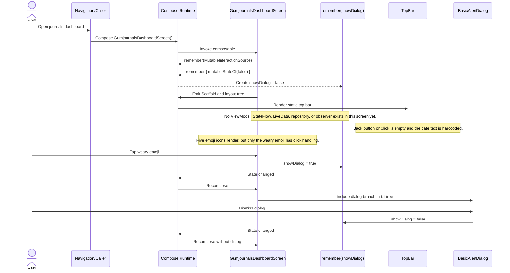

# Gumjournals Dashboard Screen Sequence

Source: `gumjournals/presentation/src/main/java/com/gumrindelwald/gumrjournals/presentation/DashboardScreen.kt`

## What happens when the user opens the screen

## Current architecture note

This screen is using only local Compose state.

- `remember { MutableInteractionSource() }` is used for the click interaction source.
- `remember { mutableStateOf(false) }` stores whether the dialog is visible.
- There is currently no `ViewModel`, observer, side effect, asynchronous load, or data fetch when the screen opens.
